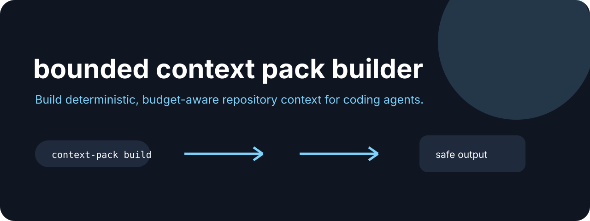

# Context Pack



**Build deterministic, budget-aware repository context for coding agents.**

[](https://github.com/jonah-ux/context-pack/actions/workflows/ci.yml)
[](https://www.python.org/)
[](LICENSE)

Context Pack walks a repository in deterministic order, skips common generated directories,
stays under a byte budget, and writes a Markdown bundle with a SHA-256 digest. It is a small,
inspectable answer to “what context should this coding agent see?”

## Try it in 30 seconds

```bash
git clone https://github.com/jonah-ux/context-pack.git
cd context-pack
python3 -m pip install .
python3 demos/demo.py
```

Build a bounded pack from the current repository:

```bash
context-pack build . --max-bytes 12000 --out context-pack.md
```

Create a redacted provenance manifest beside the pack, then verify the source selection and
rendered pack later:

```bash
context-pack build . --max-bytes 12000 --out context-pack.md --manifest context-pack.json
context-pack verify . --manifest context-pack.json
```

The `context-pack/manifest/v1` document records the selection policy, selected relative paths,
file sizes, SHA-256 content digests, skipped-file reasons, pack digest, and tool version. It does
not copy source text into the manifest. Verification exits `1` when source files, the pack, or the
manifest digest has changed. Compare two authenticated manifests without reading source content:

```bash
context-pack diff before/context-pack.json after/context-pack.json
context-pack diff before/context-pack.json after/context-pack.json --check
```

`diff/v1` reports added, removed, and changed files plus selection-policy and digest changes;
`--check` exits `1` when the source packs differ. Output locations are reported separately so a
pack copied to another machine can still compare as the same source selection.

## See it work

The demo reports the bounded file set, byte count, and digest so another agent can verify the same pack:

```json
{"schema":"context-pack/v1","bytes":38,"files":["README.md","hello.py"],"sha256":"fdd85e8274d91d749c3ad18802483589da4272643eee9d6475c84d0f88c9a6a1"}
```

## Open the five-minute walkthrough

The [bounded context walkthrough](docs/walkthrough.html) is a dependency-free, keyboard-friendly
tour of the selection budget, skip reasons, manifest digest, and verification path. It uses an
illustrative browser fixture so you can click through the states without pretending a browser has
run your local CLI. Copy the commands in the final panel to reproduce the same ideas against a real
checkout.

The tiny joke is intentional: context-pack gives an agent the map and leaves the entire junk drawer
outside the backpack.

## Related tools

Use [Chatlens](https://github.com/jonah-ux/chatlens) to recover prior context, [Agent Eval Kit](https://github.com/jonah-ux/agent-eval-kit) to test a promptable command, and [Agent Resume](https://github.com/jonah-ux/agent-resume) to carry the exact repository identity forward.

The `context-pack/v1` JSON summary reports the selected files, byte count, root, and digest.
The Markdown output stays readable in a text editor and easy for an agent to ingest.

Manifest paths are relative to the packed root, and manifest verification is fail-closed. The
manifest is a provenance snapshot of the selected source state; it is not a signature or a
complete repository backup.

## Development

```bash
python -m unittest discover -s tests
python -m build --sdist --wheel
python demos/demo.py
```

The pack is bounded and deterministic; it is not a complete repository backup or a guarantee
that omitted files are irrelevant.

MIT licensed.
