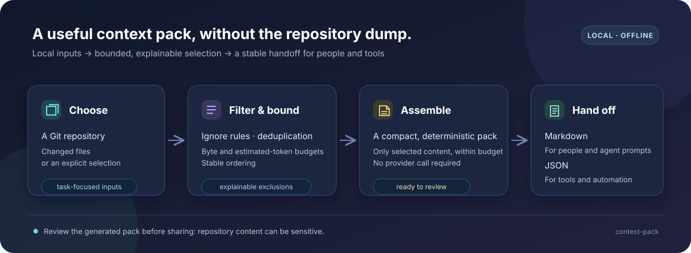

# context-pack

[](https://github.com/jonah-ux/context-pack/actions/workflows/ci.yml)
[](https://www.python.org/)
[](LICENSE)

**A small, local-first CLI for building focused, reproducible context packs from Git repositories.**

`context-pack` gathers the files that matter for a task—such as changed files or an explicit selection—and turns them into a bounded briefing for a coding agent or a person. It respects repository ignore rules, applies byte and estimated-token budgets, removes duplicate content, orders results deterministically, and makes exclusions explainable. Choose readable Markdown or machine-friendly JSON output.



## Install

Requires Python 3.11 or newer. Install the CLI from this repository with [pipx](https://pipx.pypa.io/):

```bash
pipx install git+https://github.com/jonah-ux/context-pack.git
```

To upgrade later:

```bash
pipx upgrade context-pack
```

## Quick start

From the repository you want to brief, inspect the current changes:

```bash
context-pack --changed --max-bytes 80000 --max-tokens 20000
```

Or select files explicitly and emit JSON for automation:

```bash
context-pack src/app.py README.md --format json --output context-pack.json
```

`context-pack --help` lists all options. Packs are written to standard output unless `--output` is set. Changed files are the default when no file arguments are given. The tool runs locally; it does not require an LLM provider, API key, or runtime package dependencies.

To see a small end-to-end run in a disposable synthetic Git repository after installation:

```bash
bash examples/demo.sh
```

## What it does

- **Focuses on task-relevant files:** work from Git changes or an explicit file selection rather than dumping a whole repository.
- **Honors ignore rules:** avoid routinely including generated output and other ignored files.
- **Stays within a budget:** constrain pack size by bytes and estimated tokens.
- **Reduces repetition:** deduplicate identical content before assembling the pack.
- **Explains its choices:** make exclusions visible so a small result is understandable, not mysterious.
- **Produces repeatable output:** stable file ordering and deterministic assembly make packs easier to compare and reuse.
- **Fits people and tools:** emit Markdown for review or JSON for downstream processing.

A context pack is a compact starting point—not a substitute for reading source files, reviewing sensitive content, or verifying claims against the repository.

## Development

The project targets Python 3.11+ and has no runtime dependencies. To install the development test tools and run the test suite:

```bash
python -m venv .venv
# Activate the environment: source .venv/bin/activate (macOS/Linux)
# On Windows PowerShell: .venv\Scripts\Activate.ps1
python -m pip install --editable ".[test]"
python -m pytest
```

See [Contributing](CONTRIBUTING.md) for the contribution workflow and [the release guide](docs/releasing.md) for packaging and release steps.

## Security and license

Context packs can contain source code and configuration. Inspect generated output before sharing it, especially when explicitly selecting files. See [SECURITY.md](SECURITY.md) for safe-use guidance and vulnerability reporting. Released under the [MIT License](LICENSE).
